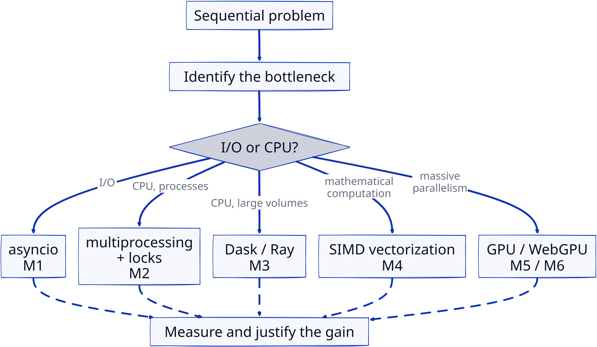

This page recaps the thread of the module and serves as a **navigation map** for the
autonomous work. It complements the modules: it helps you situate each concept.

## The thread: parallelism is not free

The single theme of the course fits in one sentence: parallelizing means decomposing to
speed up, but every decomposition has a cost (scheduling, communication, memory,
synchronization). The speed curve is never linear in the number of workers.

## Map of the 6 modules

| Module | Question it addresses | Main tools | Bottleneck targeted |
|---|---|---|---|
| M0 — Intro | What does *parallelizing* mean? | Amdahl/Gustafson laws, Flynn's taxonomy | vocabulary |
| M1 — Asynchronous | How not to *wait*? | `asyncio`, event loop, `gather` | I/O |
| M2 — IPC & locks | How to *coordinate* processes? | `multiprocessing`, `Queue`, `Lock` | shared CPU |
| M3 — Distributed | How to *split* a large computation? | `dask`, `ray`, `delayed` | large volumes |
| M4 — SIMD | How to use one *instruction* for several data? | numpy, numba | vector computation |
| M5 — GPU | How to exploit *many* simple cores? | CuPy, numba-CUDA | massive parallelism |
| M6 — WebGPU | How to compute in the *browser*? | WebGPU, WGSL | GPU access |

## Cross-cutting watch points

- **Python's GIL** only blocks threads on CPU-bound work; asyncio is for I/O,
  multiprocessing is for CPU-bound work.
- **Always measure** before and after: only timing (with the cost of transfers for the GPU)
  justifies an architecture choice.
- **A lock serializes a critical section**: it prevents races but introduces waiting and a
  risk of *deadlock*.
- **Shared state is the enemy of parallelism**: prefer pure tasks (no mutation, no side
  effects) as recommended by Dask best practices.

## Indicative deadlines

| Deliverable | Due |
|---|---|
| Track choice + survey | S1 (26/08) |
| Learning plan (+ prompt for A) | before S5, validated in S5 (22/09) |
| Logbook | ongoing, checks S6–S8, synthesis before S9 |
| Comparative report (reflexive + observational) | before S9 (indicative 20/10) |
| Final project (report + defense) | defense S11 (18/11), report before |
| Final metacognitive report | S12 (19/11) |

## Where to start

1. **Read the teaching design** (`teaching-design.qmd`): it is the framework, everything
   follows from it.
2. **Choose your hardware** (see `prerequisites.qmd` to install the tooling, online or local
   LLM depending on your machine).
3. **Write your learning plan** (template in `learning-plan.qmd`): it sets the order and the
   success criteria; it is your roadmap.
4. **Module 0 first**, then M1 → M2 → M3, and depending on your objectives M4 → M5 → M6.
