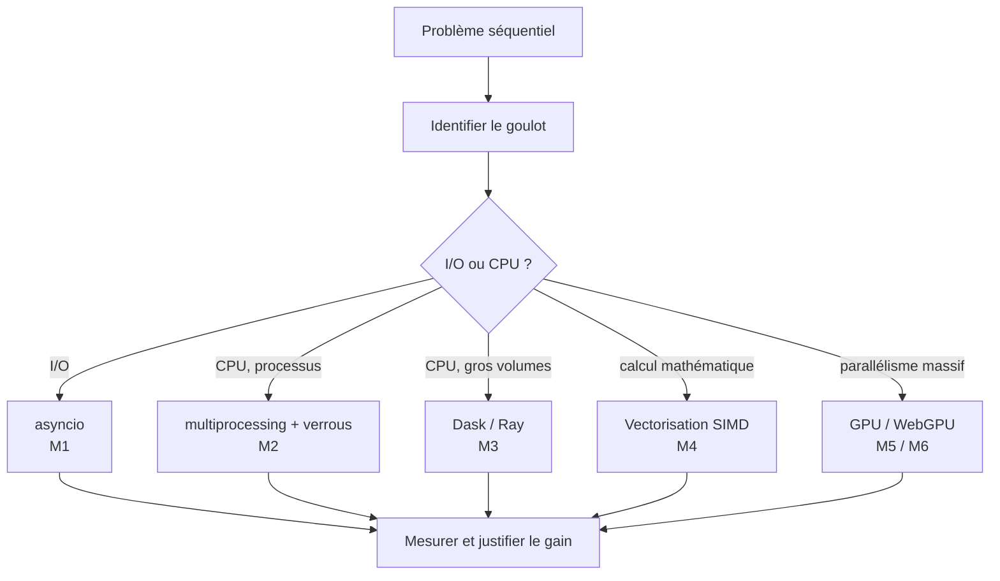

Cette page récapitule le fil conducteur du module et sert de **carte de navigation** pour le
travail autonome. Elle ne remplace pas les modules : elle vous aide à *situer* chaque notion.

## Le fil rouge : le parallélisme n'est pas gratuit

Le thème unique du cours tient en une phrase : **paralléliser = décomposer pour accélérer,
mais chaque décomposition a un coût** (ordonnancement, communication, mémoire,
synchronisation). La courbe de vitesse n'est jamais linéaire avec le nombre de workers.

## Carte des 6 modules

| Module | Question qu'il traite | Outils principaux | Goulot visé |
|---|---|---|---|
| M0 — Intro | Que veut dire *paralléliser* ? | lois d'Amdahl/Gustafson, taxonomie de Flynn | vocabulaire |
| M1 — Asynchrone | Comment ne pas *attendre* ? | `asyncio`, event loop, `gather` | entrées/sorties |
| M2 — IPC & verrous | Comment *coordonner* des processus ? | `multiprocessing`, `Queue`, `Lock` | CPU partagé |
| M3 — Distribué | Comment *découper* un gros calcul ? | `dask`, `ray`, `delayed` | gros volumes |
| M4 — SIMD | Comment utiliser une *instruction* pour plusieurs données ? | numpy, numba | calcul vectoriel |
| M5 — GPU | Comment exploiter *beaucoup* de cœurs simples ? | CuPy, numba-CUDA | parallélisme massif |
| M6 — WebGPU | Comment calculer dans le *navigateur* ? | WebGPU, WGSL | GPU access |

## Points de vigilance transverses

- **Le GIL de Python** ne bloque que les *threads* sur du CPU-bound ; asyncio sert aux I/O,
  multiprocessing aux CPU-bound.
- **Toujours mesurer** avant et après : seul un chronométrage (avec le coût des transferts
  pour le GPU) justifie un choix d'architecture.
- **Un verrou n'est pas une baguette magique** : il protège une section critique mais
  introduit attente et risque de *deadlock*.
- **L'état partagé est l'ennemi du parallélisme** : préférer des tâches *pures* (pas de
  mutation, pas d'effets de bord) comme le recommandent les bonnes pratiques de Dask.

## Échéances indicatives

| Rendu | Échéance |
|---|---|
| Choix de parcours + sondage | S1 (26/08) |
| Plan d'apprentissage (+ prompt A) | avant S5, validé en S5 (22/09) |
| Journal de bord | continu, contrôles S6–S8, synthèse avant S9 |
| Rapport comparé (réflexif + observationnel) | avant S9 (indicatif 20/10) |
| Projet final (rapport + soutenance) | soutenance S11 (18/11), rapport avant |
| Rapport métacognitif final | S12 (19/11) |

## Par où commencer

1. **Lisez le dispositif** (`dispositif.qmd`) : c'est le cadre, tout en découle.
2. **Choisissez votre matériel** (voir `intro.qmd` pour installer l'outillage, LLM en ligne ou
   local selon votre machine).
3. **Rédigez votre plan d'apprentissage** (gabarit dans `plan-apprentissage.qmd`) : il fixe
   l'ordre et les critères de réussite — c'est votre feuille de route.
4. **Module 0 d'abord**, puis M1 → M2 → M3, et selon vos objectifs M4 → M5 → M6.
